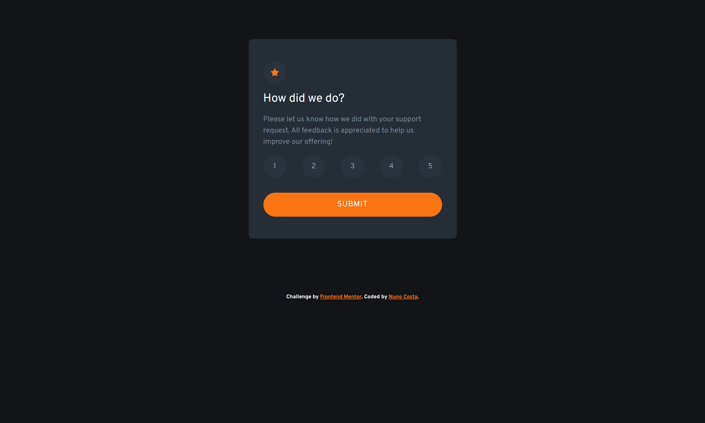
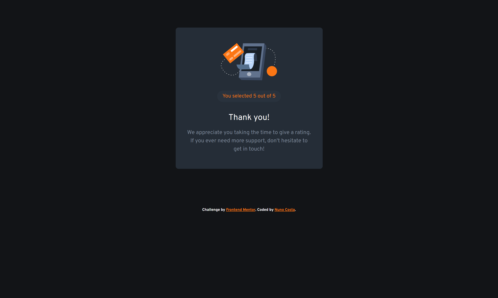

# Frontend Mentor - Interactive rating component solution

This is a solution to the [Interactive rating component challenge on Frontend Mentor](https://www.frontendmentor.io/challenges/interactive-rating-component-koxpeBUmI). Frontend Mentor challenges help you improve your coding skills by building realistic projects.

## Table of contents

- [Overview](#overview)
  - [The challenge](#the-challenge)
  - [Screenshot](#screenshot)
  - [Links](#links)
- [My process](#my-process)
  - [Built with](#built-with)
  - [What I learned](#what-i-learned)
  - [Continued development](#continued-development)
- [Author](#author)

## Overview

### The challenge

Users should be able to:

- View the optimal layout for the app depending on their device's screen size
- See hover states for all interactive elements on the page
- Select and submit a number rating
- See the "Thank you" card state after submitting a rating

### Screenshot

<h4 align="center"><strong>Mobile/Desktop Design</strong></h4>

### Links

- Solution URL: [Solution URL](https://www.frontendmentor.io/solutions/interactive-rating-challenge-htmlcssjs-FL6lr8vbUn)
- Live Site URL: [Live site URL](https://interactive-rating-component-challenge-mocha.vercel.app/)

## My process

### Built with

- Semantic HTML5 markup
- CSS custom properties
- Flexbox

### What I learned

For this project, I found it quite simple the main difficulties I had was when using Javascript to accomplish the different hover states and to insert the rating in the success page. Websites like stack overflow were really helpful.

### Continued development

In the future projects I want to use Javascript more frequently to really get used to it specially because I get the feeling that I need to google every anser Javascript related.

## Author

- Frontend Mentor - [@Bottom17](https://www.frontendmentor.io/profile/Bottom17)
